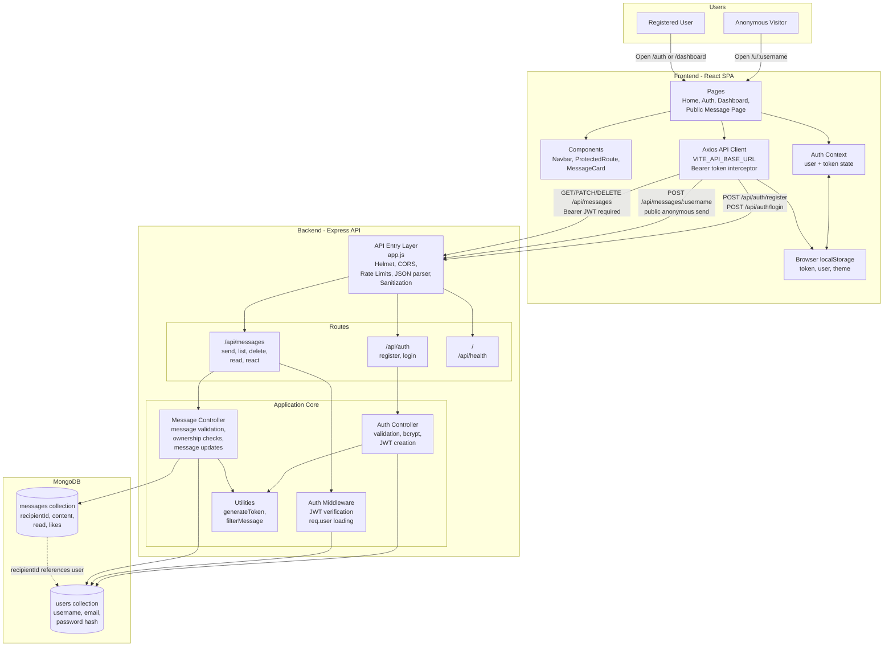
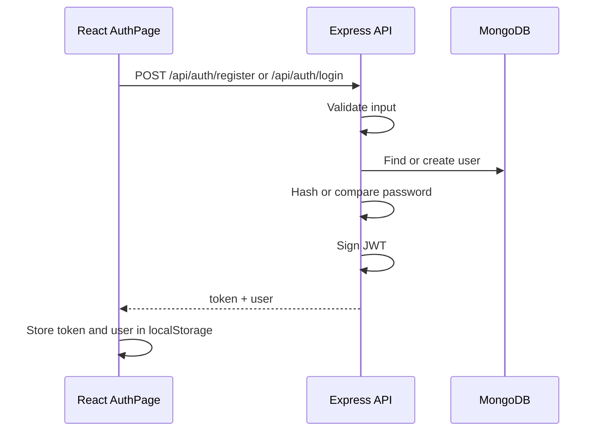
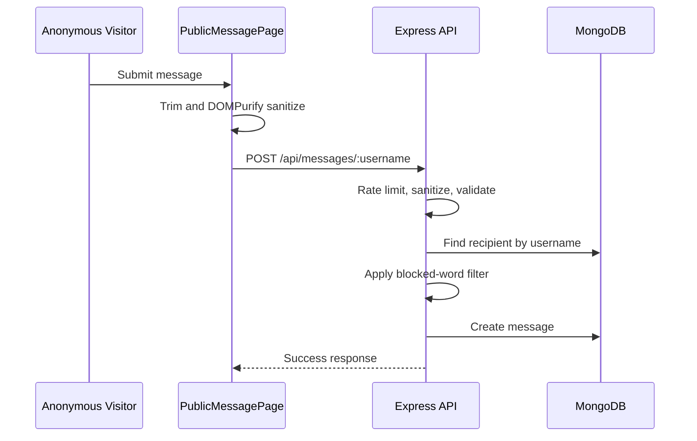
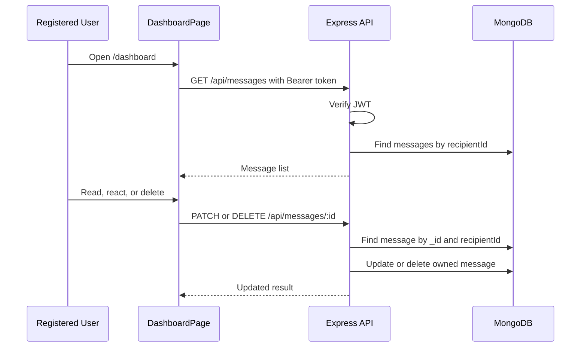

# WhisperBox Architecture

## Overview

WhisperBox is a full-stack anonymous messaging application. A registered user creates an account, receives a public profile link, and shares that link with others. Visitors can submit anonymous messages without logging in. The registered user can then view, mark, react to, and delete those messages from a protected dashboard.

The system is split into three main layers:

- Frontend: React SPA in `frontend/`
- Backend API: Express application in `backend/`
- Database: MongoDB accessed through Mongoose

## Architecture Diagram



Note: this project does not currently include a standalone API gateway service. The Express application in `backend/src/app.js` acts as the API entry layer by applying cross-cutting middleware before forwarding requests to route modules.

## Project Structure

```text
.
|-- backend
|   |-- Dockerfile
|   |-- package.json
|   `-- src
|       |-- app.js
|       |-- server.js
|       |-- config
|       |   `-- db.js
|       |-- controllers
|       |   |-- authController.js
|       |   `-- messageController.js
|       |-- middleware
|       |   `-- authMiddleware.js
|       |-- models
|       |   |-- Message.js
|       |   `-- User.js
|       |-- routes
|       |   |-- authRoutes.js
|       |   `-- messageRoutes.js
|       `-- utils
|           |-- filterMessage.js
|           `-- generateToken.js
|-- frontend
|   |-- Dockerfile
|   |-- package.json
|   `-- src
|       |-- App.jsx
|       |-- main.jsx
|       |-- api
|       |   `-- client.js
|       |-- components
|       |-- context
|       `-- pages
|-- docker-compose.yml
|-- render.yaml
|-- README.md
`-- ARCHITECTURE.md
```

## Frontend Architecture

The frontend is a Vite React single-page application.

Key files:

- `frontend/src/main.jsx`: React entry point. Wraps the app in `BrowserRouter` and `AuthProvider`.
- `frontend/src/App.jsx`: Defines app routes, theme handling, navbar, and toast notifications.
- `frontend/src/api/client.js`: Creates the Axios client and attaches `Authorization: Bearer <token>` when a token exists in `localStorage`.
- `frontend/src/context/AuthContext.jsx`: Stores authenticated user and JWT token in React state and `localStorage`.
- `frontend/src/components/ProtectedRoute.jsx`: Protects the dashboard route.

Frontend routes:

| Route | Page | Purpose |
| --- | --- | --- |
| `/` | `HomePage` | Landing/home page. |
| `/auth` | `AuthPage` | Login and registration. |
| `/dashboard` | `DashboardPage` | Protected message inbox. |
| `/u/:username` | `PublicMessagePage` | Public anonymous message form. |

## Backend Architecture

The backend is an Express API.

Key files:

- `backend/src/server.js`: Loads environment variables, connects to MongoDB, and starts the HTTP server.
- `backend/src/app.js`: Configures middleware, CORS, rate limits, health routes, and API routes.
- `backend/src/config/db.js`: Connects Mongoose to MongoDB.
- `backend/src/routes/authRoutes.js`: Defines auth endpoints.
- `backend/src/routes/messageRoutes.js`: Defines message endpoints.
- `backend/src/middleware/authMiddleware.js`: Verifies JWT tokens and loads the current user.

Backend middleware stack:

1. `helmet()` for security headers.
2. `cors()` for frontend origin control.
3. Global rate limiter.
4. `express.json({ limit: "20kb" })`.
5. Mongo operator sanitization for body and params.
6. String escaping for body and params.
7. Route handlers.
8. 404 fallback handler.

## API Endpoints

| Method | Path | Auth Required | Purpose |
| --- | --- | --- | --- |
| `GET` | `/` | No | API metadata. |
| `GET` | `/api/health` | No | Health check. |
| `POST` | `/api/auth/register` | No | Create account and return JWT. |
| `POST` | `/api/auth/login` | No | Authenticate and return JWT. |
| `GET` | `/api/messages` | Yes | Fetch authenticated user's inbox. |
| `POST` | `/api/messages/:username` | No | Send anonymous message to a user. |
| `DELETE` | `/api/messages/:id` | Yes | Delete an owned message. |
| `PATCH` | `/api/messages/:id/read` | Yes | Toggle read/unread for an owned message. |
| `PATCH` | `/api/messages/:id/react` | Yes | Increment reaction count for an owned message. |

## Data Model

### User

Defined in `backend/src/models/User.js`.

| Field | Type | Notes |
| --- | --- | --- |
| `username` | String | Required, unique, lowercase, 3-24 chars. |
| `email` | String | Required, unique, lowercase, email-validated. |
| `password` | String | Required bcrypt hash, hidden by default. |
| `createdAt` | Date | Added by Mongoose timestamps. |
| `updatedAt` | Date | Added by Mongoose timestamps. |

### Message

Defined in `backend/src/models/Message.js`.

| Field | Type | Notes |
| --- | --- | --- |
| `recipientId` | ObjectId | Required reference to `User`, indexed. |
| `content` | String | Required, 1-500 chars. |
| `read` | Boolean | Defaults to `false`. |
| `likes` | Number | Defaults to `0`. |
| `createdAt` | Date | Added by Mongoose timestamps. |
| `updatedAt` | Date | Added by Mongoose timestamps. |

Messages do not store sender identity in the application schema.

## Core Flows

### Registration and Login



### Anonymous Message Submission



### Inbox Management



## Security Design

Implemented protections:

- Password hashing with bcrypt.
- JWT-based bearer authentication.
- Password hashes excluded from normal user queries.
- Server-side message ownership checks.
- Helmet security headers.
- CORS allowlist from `CLIENT_URLS` or `CLIENT_URL`.
- Global API rate limit.
- Stricter anonymous message rate limit.
- Request body size limit.
- NoSQL injection sanitization.
- String escaping for submitted body and route params.
- Client-side `DOMPurify` sanitization before public message submission.

Security considerations:

- JWTs are stored in `localStorage`, which is simple but vulnerable if XSS is introduced.
- `JWT_SECRET` is required for correct security but is not explicitly validated at startup.
- Message content may be escaped more than once because there is global escaping and controller-level escaping.
- Anonymous submissions intentionally do not store sender identity, which limits moderation and investigation options.

## Configuration

Backend environment variables:

| Variable | Purpose |
| --- | --- |
| `PORT` | API port. Defaults to `5000`. |
| `MONGO_URI` | MongoDB connection string. Required. |
| `JWT_SECRET` | Secret for signing and verifying JWTs. |
| `JWT_EXPIRES_IN` | JWT lifetime. Defaults to `7d`. |
| `CLIENT_URL` | Single allowed frontend origin. |
| `CLIENT_URLS` | Comma-separated allowed frontend origins. |

Frontend environment variables:

| Variable | Purpose |
| --- | --- |
| `VITE_API_BASE_URL` | Backend API base URL. Defaults to `http://127.0.0.1:5000/api`. |

## Deployment

### Docker Compose

`docker-compose.yml` starts:

- `mongo`: MongoDB 7 on port `27017`.
- `backend`: Express API on port `5000`.
- `frontend`: Vite frontend on port `5173`.

The backend container connects to MongoDB through the internal Docker hostname:

```env
MONGO_URI=mongodb://mongo:27017/anonymous_messages
```

### Render

`render.yaml` defines the backend service:

- Root directory: `backend`
- Build command: `npm install`
- Start command: `npm start`
- Runtime: Node 20

The frontend is expected to be deployed separately, for example on Vercel, with `VITE_API_BASE_URL` pointing to the deployed backend API.

## Current Limitations and Improvement Areas

- No automated tests are defined yet.
- No pagination exists for inbox messages.
- The frontend Dockerfile runs a Vite development server instead of serving a production build.
- Token expiration is not handled globally on the frontend.
- There is no centralized error-handling middleware.
- There is no request logging or production observability layer.
- Abuse protection is basic and relies mainly on rate limits plus a simple blocked-word filter.
